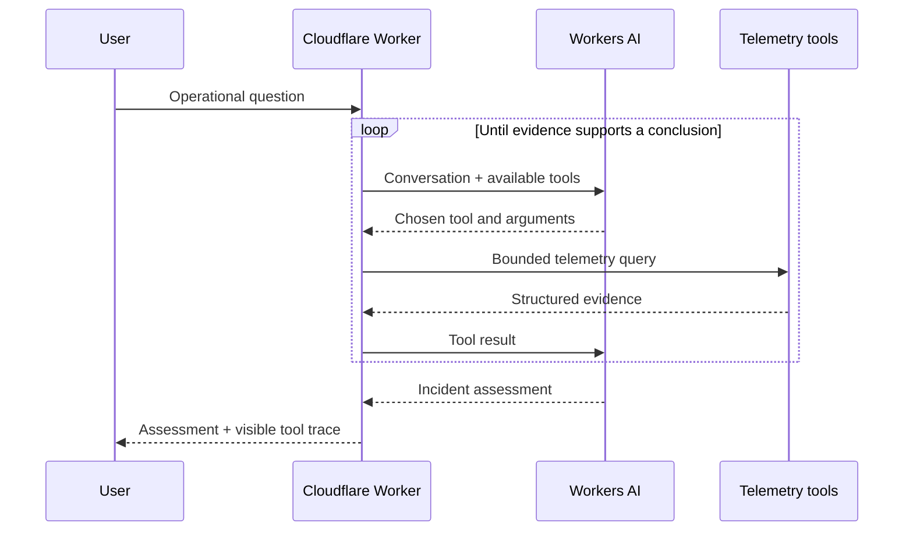

# SignalFlare

SignalFlare is an autonomous incident investigator deployed on Cloudflare Workers. Give it an operational question and it chooses tools, gathers evidence across a small instrumented service topology, and returns a concise root-cause assessment with a visible tool trace.

> **Live demo:** https://signalflare-incident-agent.kbdevs.workers.dev

## Try it

Open the demo and ask:

> Why are checkout requests failing, when did it start, and what should we do?

The environment contains a deterministic synthetic incident, not a hard-coded answer. The agent must discover the causal chain by correlating telemetry. The data models an edge gateway, checkout, inventory, payments, and PostgreSQL service with logs and distributed traces from an instrumented checkout flow.

## How it works



The loop is implemented explicitly in [`src/agent.ts`](src/agent.ts). It is not a single prompt: the model decides what to inspect next based on each tool result. The Worker enforces a maximum of seven planning iterations and ten tool calls, validates every tool argument, caches exact duplicate calls, and falls back to a clearly marked partial assessment if model synthesis fails.

The reviewer interface is a deliberately minimal grayscale React/Tailwind console built from local shadcn/ui primitives. It keeps the prompt, service snapshot, incident report, and agent tool trace on one screen without a marketing shell.

### Agent tools

| Tool | Purpose |
| --- | --- |
| `list_services` | Establish health, versions, and dependency topology |
| `query_metrics` | Compare a specific current or baseline service metric |
| `search_logs` | Find structured error events and trace IDs |
| `inspect_trace` | Follow a request span by span to locate time and failures |
| `list_recent_changes` | Correlate deployments and configuration diffs with symptoms |

## Design decisions and tradeoffs

- **Depth over integrations.** Five bounded tools operate over one coherent scenario. This makes the investigation reliable and reviewable instead of spreading effort across half-working provider APIs.
- **Real agent loop, visible behavior.** Native Workers AI function calling drives multiple model turns. The UI exposes a summarized tool trace without exposing chain-of-thought.
- **Deterministic telemetry.** Reviewers see the same incident and can try adversarial or differently phrased questions. In production, the tool implementations would call Cloudflare Analytics, an OTel backend, and deployment APIs without changing the agent loop.
- **Evidence minimum.** The orchestration requires three distinct evidence types before allowing a final answer. That is a guardrail against plausible diagnoses based on one noisy signal.
- **Bounded failure modes.** Tool inputs are allow-listed, results are size-limited, logs are explicitly treated as untrusted data, and both tool and model budgets are capped.
- **No persistence.** Each request is independent. Durable Objects would be useful for multi-turn investigations or a watchdog that maintains a baseline, but add little to this focused demo.

## Local development

Prerequisites: Node.js, npm, and a Cloudflare account with Workers AI enabled.

```bash
npm install
npm run check
npm run dev
```

`wrangler dev --remote` is used because Workers AI runs through a remote binding. Standard Workers AI usage charges may apply.

## Deploy

```bash
npm run deploy
```

The Worker configuration in [`wrangler.jsonc`](wrangler.jsonc) declares the Workers AI and static asset bindings. No model-provider API key or login screen is required for the deployed app.

## What I would do next

1. Replace the demo adapters with read-only Cloudflare GraphQL Analytics, Workers Logs, and deployment APIs.
2. Store investigation sessions in a Durable Object so a reviewer can ask follow-up questions without resending all evidence.
3. Stream tool activity to the UI with server-sent events and add per-tool latency/token observability.
4. Add an evaluation set containing ambiguous incidents, partial outages, telemetry gaps, and prompt-injection strings inside logs.
5. Introduce a scheduled watchdog that learns a rolling baseline and opens an investigation when multiple signals drift together.
